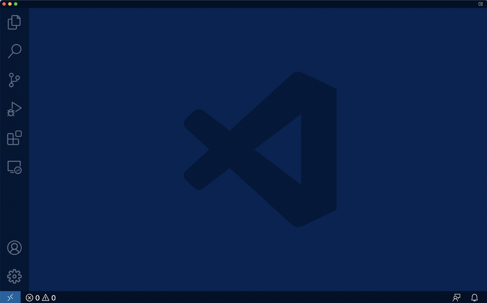

# CSE 15L: Logging into a course-specific account on ieng6 Tutorial

## Installing VScode

Go to the website [Visual Studio Code](https://code.visualstudio.com/) and download the appropriate version of VS Code for your type of laptop (MacOS/Windows).

After Installing VS Code you should be able to see a screen similar to this.

Congrats you have successfully installed Visual Studio Code!

## Remotely Connecting

Now that you have

## Trying Some Commands

## Moving Files with scp

## Setting an SSH Key

## Optimizing Remote Running

