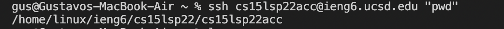

# CSE 15L: Logging into a course-specific account on ieng6 Tutorial

## Installing VScode

Go to the website [Visual Studio Code](https://code.visualstudio.com/) and download the appropriate version of VS Code for your type of laptop (MacOS/Windows).

After Installing VS Code you should be able to see a screen similar to this.

Congrats you have successfully installed Visual Studio Code!

## Remotely Connecting

Now that you have VS Code installed we are going to connect to a remote computer using the account provided to you by the school. 

If you are on windows install [OpenSSH](https://docs.microsoft.com/en-us/windows-server/administration/openssh/openssh_install_firstuse), if you are on MacOS you can skip this step.

Next, if you do not know your course-specific account you will have to log in [HERE](https://sdacs.ucsd.edu/~icc/index.php). Write down the name of your account which should look something similar to the two dark gray boxes under the "Additional Accounts" category. 

Your course specific account for this class will be the one that begins with "cse15lsp22" the three letters following that string are very important they are what make your account yours. For example mine is "acc".

Here comes the hard part but dont worry you got this!

(IMPORTANT: make sure you reset your password to your course specific account if you havent already. Intruction on how to do so are here in this [PDF](https://cdn-uploads.piazza.com/paste/ktv2gnof3sx5bf/181c3cb053df5cf1ccaf0457f56f12a2e5aa90b139aef8c2ea8fcc590f02fadf/How-to-Reset-your-Password.pdf))

1. Now that you have reset your password you are going to open VS Code and open a new terminal with Ctrl + ` or whatever other method you prefer and type in (remember to change the zz to your specific account name)

ssh cs15lsp22zz@ieng6.ucsd.edu

2. A message will pop up that look like this if you are connecting for the first time type yes and click enter:

Are you sure you want to continue connecting (yes/no/[fingerprint])?

3. When you log in successfully your screen should look like this.

Congrats your computer(aka. the client) has successfully remotely logged into a computer in the CSE basement(ake. the server). 

## Trying Some Commands
Now lets test out your newly found power. Go ahead and run some commands in the terminal. Some popular commands you can use are: cd, ls, pwd. Feel free to experiment and learn some of the essential commands like cd which stand for "change directory".

Here is an example of me using "cd .." which moved me up a directory and then I input "ls" which list all of the files/directories of the directory I am currently on.

Congrats, you have learned some basic commands to use on the terminal.

## Moving Files with scp

Now we are going to learn how to move files from your computer onto there server. 

1. Close your terminal and create a new file on VS Code titled "WhereAmI.java" and in that file you are going to copy and paste the following contents: 

class WhereAmI {
 public static void main(String[] args) {
    System.out.println(System.getProperty("os.name"));
    System.out.println(System.getProperty("user.name"));
    System.out.println(System.getProperty("user.home"));
    System.out.println(System.getProperty("user.dir"));
  }
}

Make sure to add appropriate spacing so that the contents appear in this manner:

2. Open a new terminal and compile your file with "javac" and run it with "java". 

3. In that same terminal you are going to input the following line (remember to use your specific account username):

scp WhereAmI.java cs15lsp22zz@ieng6.ucsd.edu:~/

4. The terminal will ask for a password, input the same password you put when you log in to the server. 

5. Once you finish step 4 you will need to log into the server using ssh, if you forgot how to log in return to the step titled "Remotely Connecting".

6. Now that you are logged in you are going to type "ls" into the terminal to confirm that the "whereAmI.java" file copied and pasted correcty from the client to the server. Then type "javac WhereAmI.java" and java WhereAmI.java" each on its own line in the terminal. 

(If done correctly you should recieve and terminal similar to the following image but keep in mind I will have a different output then your since I have a different account.)

Congrats you have successfully copied and pasted a file from your computer onto the server. 

## Setting an SSH Key

For these past few step whenever we use a SSH or SCP command we have to copy and paste our password onto the terminal. Computers are all about efficientcy and having to copy and paste your password over and over again is anything but efficient, thus we are going to "ssh keys" with a program called "ssh-keygen".

1. On your computer you are going to open a new terminal and type:

ssh-keygen

(DO NOT add a passphrase)

After completing the first step your terminal should appear like this:

2. This step if for Windows users so if you are on MacOS you can skip this step. You will need to do the extra "ssh-add". for more steps access this [website](https://docs.microsoft.com/en-us/windows-server/administration/openssh/openssh_keymanagement#user-key-generation).

3. The public key and private key are currently being stored at the .ssh directory on the client(aka. your computer). We will now copy the **PUBLIC** key onto the .ssh directory of the server. To do so follow the following bullet points in order.

* Log onto the server using the ssh command.
* Type the following line: mkdir .ssh
* Type the following line aswell: <logout>
* Now type this line and make sure to use your account specific username: scp /Users/<user-name>/.ssh/id_rsa.pub cs15lsp22zz@ieng6.ucsd.edu:~/.ssh/authorized_keys

(A common error is to not put the appropriate client name where it says "<user-name>", for example on my client the name is "gus" so I will type that on the "<user-name>" section.

Here is an example of what it looks like to correctly use the scp command. (credit for the following image goes to my CSE 15L teammate Beneen Fune)

Once you have completed all those steps you will now be able to use ssh and scp commands without having to type in your password. 

Here is an example of what logging in looks like without having to type in your password.

If you are able to view a screen similar to this when you log in then Congrats you have successfully used your SSH Keys.

## Optimizing Remote Running

Now that you have completed all these steps you are one step closer to being a pro at manipulating the terminal to do whatever you disire but lets learn some quick tips to optimize our efficiency.

1. Type a command within quotation marks while logging into a directory to save a line of space (In the following example I type pwd and log into the server in one line):

2. You can also use a ";" semicolon in between commands to type them in one line.

3. You can use the up arrow key on your keyboard recall previous commands put on the terminal.

4. Hit tab when typing the first few letters of a command or directory to auto-finish what you were tying.

There are many more ways to save time and space with little tips and tricks that exist. Now that you have completed this tutorial you can feel a little more confident with your coding skills. **Congrats!!!**
