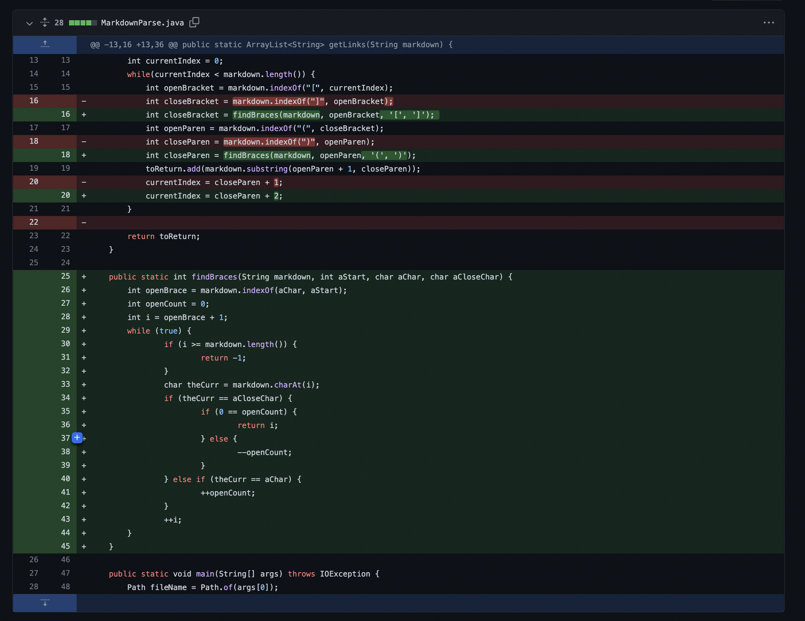
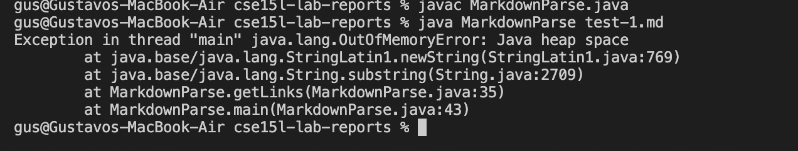
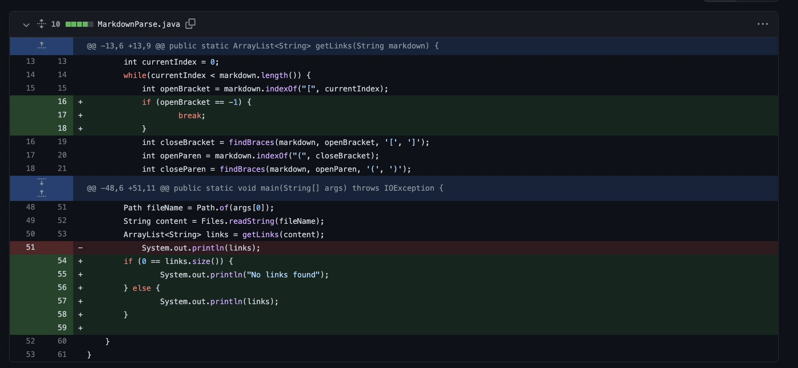
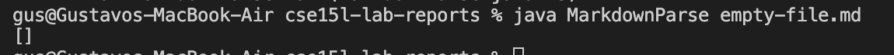
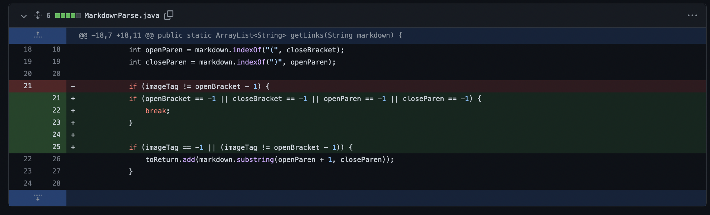
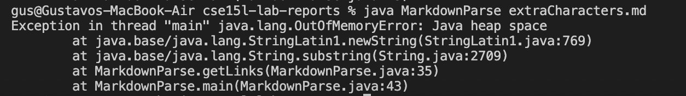

# CSE 15L: Lab Report 2 Week 4

## Code Change #1

The following Image is the changes made to the main class to fix the nested paranthesis error within link.

Link to the "failure-inducing input" that prompted this change can be found [here](https://github.com/333GUSSS/markdown-parser/commit/5721b43246c6562babdbe6b638e8e3079b5a4111).

Below is the image of the symptom of the failure-inducing input.

The bug in the main class is that the code cannot distinguish what paranthesis is a part of the syntax and what part if from the link. The input has a link that has a set of paranthesis within the syntax parathesis for a link in Mark Down. Thus we get the exception sympton where the file wont run since syntax is currupt.

## Code Change #2

The following Image is the changes made to the main class to fix the case with no links found.

Link to the "failure-inducing input" that prompted this change can be found [here](https://github.com/333GUSSS/markdown-parser/commit/d64952ee58f187d5a2a42357baf1750345c7d45b). Please notice that the commit you are looking for is the very bottom one that is an empty file.

Below is the image of the symptom of the failure-inducing input.

The bug in the main class is that the code prints an empty list when a file with no links is passed. The input is a file that has nothing within. Thus we get the output of an empty list but we wanted to print "No links are within file".

## Code Change #3

The following Image is the changes made to the main class to fix the case with extra characters after the link.

Link to the "failure-inducing input" that prompted this change can be found [here](https://github.com/LeonLin0516/markdown-parser/commit/6e34bde5b70991ba706afd3c4f9bbebcaa1d5c22). Please notice that the commit you are looking for is the very bottom one that is an empty file.

Below is the image of the symptom of the failure-inducing input.

The bug in the main class is that the code gives a "Exception in thread main" error when we pass a file with extra characters after the link. The input is a file that starts with a link and ends with a "# Title". Thus we get the output of an exception error message.