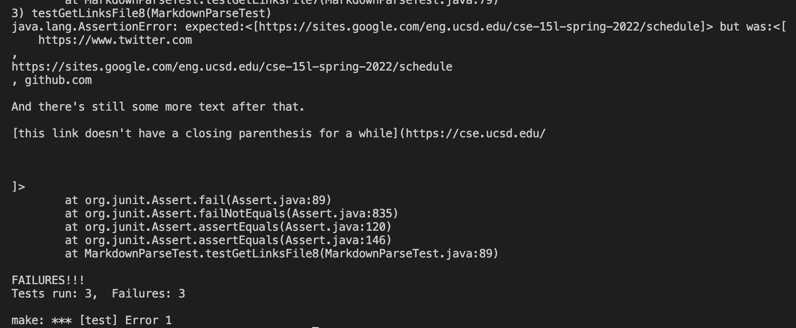

# CSE 15L: Lab Report 4 Week 8

## Repository Links

* [My Repositiory]()

* [Week 7 Reviwsed Repositiory]()

## Snippet 1
* Expected output:
 
 ['google.com, google.com, ucsd.edu]

* My Repo Test
 

 Failed :'(

 

* Week 7 Reviewed Repo Test

 Clone Failed Aswell :'(

 

* Code Change Questions

 For my repository I could add some if statement that finds any backticks and their indexes to later than ignore any text inside of the backticks so that false links like the url.com do not get taken into account as a valid link.

## Snippet 2
* expected output

[a.com, a.com(()), example.com]

* My Repo Test

Failed :'(

* Week 7 Reviewed Repo Test

 Clone Failed Aswell :'(

 

* Code Change Questions

Considereing my Lab group and I already added code that took into account nested paranthesis and brackets, I will definitely have to do a more involved changed since my groups implementation is still failed on a test case that has nested brackets and paranthesis, the difference is in our test we ignored the nested brackets/paranthesis but since in this case "a.com" is a link within the invalid "b.com" we would have to add multiple trackers to be able to distinguish a valid link within an invalid link. We can add a if statement that only counts the link within and multiple holder variables to keep track of which bracket is associated with which link so that we know which one to return.

## Snippet 3
* expected output

[https://sites.google.com/eng.ucsd.edu/cse-15l-spring-2022/schedule]

* My Repo Test

Failed :'(

* Week 7 Reviewed Repo Tes

 Clone Failed Aswell :'(

 

* Code Change Questions

Since my groups implementation ran into an index out of bounds I believe we can add a small code change that corrects the indexes we are looking at so that we do not get that simple error. There is a lot of index tracking and checking the next index so if we add a few if statements then we can correct this index out of bounds. 

