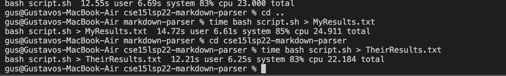
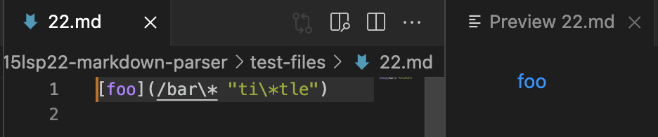
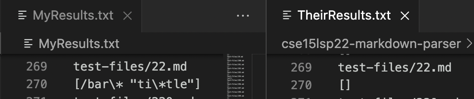
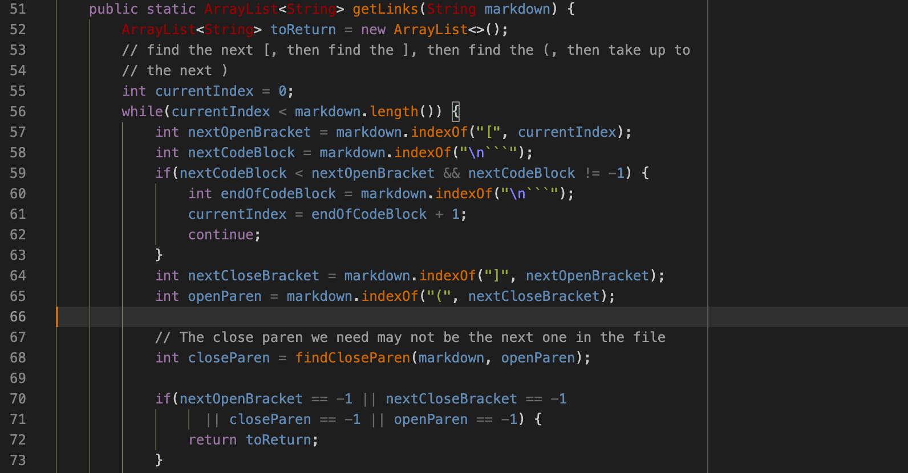
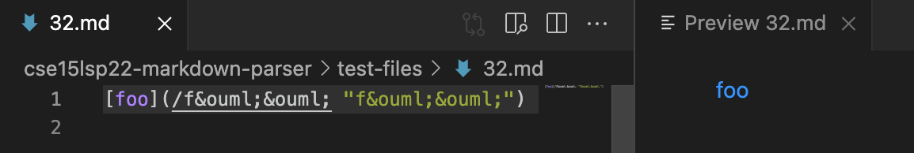
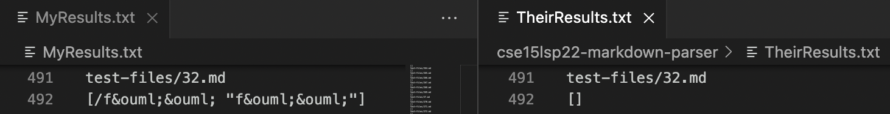

# CSE 15L: Lab Report 5 Week 10

## Repository Links

[My Repositiory](https://github.com/333GUSSS/markdown-parser)

(P.S: I downloaded the required markdown file I am comparing my repo to into my own repo but I put it as a directory called "cse15lsp22-markdown-parser", so whenever I wanted to run test in their repository I moved to that directory using the cd command.)

## How you found the tests with different results

I ran the command "time bash script.sh" in both repositories individually and piped the results into a txt file. Then I manually went to a line that had different result by having both txt file results side by side to easily compare the two.

(P.S: my groups implementation is the "MyResults.txt" file and the given comparison repo's results are in "TheirResults.txt")
## Test 1

As noted by the image above the "foo" link is valid since it meets the requirements the writeup states not only does the link need to appear in blue but it also should not display the part in the paranthesis thus "foo" is a valid link.

Since "MyResults.txt" display foo's link and we established that foo is a valid link we can conclude that my groups repository printed the correct output and the repo we were givin for this assignment has a bug since it returned an empty array.

To fix this issue I would add code that takes into account the link within the paranthesis since it seems the repository given in Lab 9 is counting valid links as invalid. My suspicion is that there is a space in the link thus it is counted as invalid. Therefore, I would add an if statement that took into account spaces and still considered any valid links within the parenthesis.

## Test 2

As noted by the image above the "foo" link is valid since it meets the requirements the writeup states not only does the link need to appear in blue but it also should not display the part in the paranthesis thus "foo" is a valid link.

Since "MyResults.txt" display foo's link and we established that foo is a valid link we can conclude that my groups repository printed the correct output and the repo we were givin for this assignment has a bug since it returned an empty array.

Similar to the last test to fix this issue I would add code that takes into account the link within the paranthesis since it seems the repository given in Lab 9 is counting valid links as invalid. My suspicion is that there is a space in the link thus it is counted as invalid. Therefore, I would add an if statement that took into account spaces and still considered any valid links within the parenthesis since they are getting ignored by their implementation.